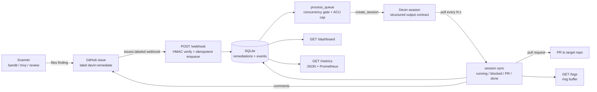

# Devin Automations

Security and quality scanners produce findings far faster than engineers can fix them, so the
backlog grows until "known issue" quietly becomes "accepted risk". **Devin Automations** closes
that loop: label a GitHub issue `devin:remediate` and this service opens a governed Devin session
that fixes exactly that finding in the target repository and opens a pull request — with an ACU
cap, a concurrency gate, HMAC-verified idempotent intake, a live operations dashboard, Prometheus
metrics, and the issue thread itself as the audit trail.

## Architecture



## Quickstart A — keyless simulation (no Devin key, no GitHub token)

```bash
cp .env.example .env      # MOCK_DEVIN=true is already the default in the example
docker compose up --build # service on http://localhost:8080
./simulate.sh             # replays sample_payloads/issue_labeled.json (issue #101)
```

Open <http://localhost:8080/dashboard>. Issue #101 moves `queued → running → PR → completed`
within ~35 seconds (mock timings: PR at 15s, completion at 30s). No network calls leave the
container: sessions are simulated in-process and GitHub comments are logged instead of posted.

## Quickstart B — live mode

1. **Devin credentials** — in your Devin settings create a *service user*, generate its API key
   (`cog_...`), and copy your organization id (`org-...`). Using a service user keeps automation
   activity attributable and separately revocable.
2. **GitHub token** — a fine-grained PAT with `Issues: read & write` on the target repo (the
   service only comments and labels; the session itself opens the PR).
3. **Webhook** — in the target repo add a webhook for *Issues* events pointing at your service,
   with a secret. For local development tunnel it with [smee.io](https://smee.io):
   ```bash
   SMEE_URL=https://smee.io/your-channel docker compose --profile tunnel up
   ```
4. **Run with shell-injected secrets** (nothing written to disk):
   ```bash
   DEVIN_API_KEY=cog_xxx DEVIN_ORG_ID=org-xxx \
   GITHUB_TOKEN=github_pat_xxx GITHUB_WEBHOOK_SECRET=whsec_xxx \
   TARGET_REPO=you/your-repo MOCK_DEVIN=false \
   docker compose up --build
   ```
5. **Trigger** — apply the `devin:remediate` label to an issue. The service comments with the
   session link and ACU cap, then with the PR link, then with the outcome summary.

## Secrets — three injection paths

| Path | How | When to use |
| --- | --- | --- |
| `.env` file | `cp .env.example .env`, fill it in; compose loads it (`required: false`) | local convenience |
| Shell environment | `DEVIN_API_KEY=... docker compose up` — listed under `environment:` as pass-through | CI, ad-hoc runs, no secret on disk |
| Secret files | mount the secret and set `DEVIN_API_KEY_FILE=/run/secrets/devin_api_key` | Docker secrets, Kubernetes |

`DEVIN_API_KEY`, `GITHUB_TOKEN` and `GITHUB_WEBHOOK_SECRET` each support the `<NAME>_FILE`
convention; the file variant wins when both are set. Example with Docker secrets:

```yaml
services:
  automations:
    environment:
      - DEVIN_API_KEY_FILE=/run/secrets/devin_api_key
    secrets: [devin_api_key]
secrets:
  devin_api_key:
    file: ./secrets/devin_api_key.txt   # git-ignored
```

No secret is ever baked into the image, committed, or logged; `.gitignore` covers `.env`, `data/`,
`__pycache__/` and `*.db*`.

## Configuration

| Variable | Default | Purpose |
| --- | --- | --- |
| `DEVIN_API_BASE` | `https://api.devin.ai/v3` | Devin API root |
| `DEVIN_API_KEY` | — | Service-user API key (`*_FILE` supported) |
| `DEVIN_ORG_ID` | — | Organization id used in the sessions URL (never hardcoded) |
| `GITHUB_TOKEN` | — | Issue comments/labels; unset = log-only (`*_FILE` supported) |
| `GITHUB_WEBHOOK_SECRET` | — | HMAC secret; unset = unsigned webhooks accepted (dev only, `*_FILE` supported) |
| `TARGET_REPO` | `priyalwalpita/superset` | Repository being remediated |
| `BASE_BRANCH` | `master` | Base branch for the PRs Devin opens |
| `TRIGGER_LABEL` | `devin:remediate` | Label that triggers a remediation |
| `MAX_ACU_LIMIT` | `5` | Hard ACU cap per session |
| `MAX_CONCURRENT_SESSIONS` | `2` | Concurrency gate; extra work waits in `queued` |
| `POLL_INTERVAL_SECONDS` | `20` | Poller cadence (heartbeat turns red past 3×) |
| `ACU_COST_USD` | `2.00` | Cost estimate multiplier |
| `ENABLE_DEVIN_REVIEW` | `false` | Ask Devin to review each PR (best effort) |
| `BYPASS_APPROVAL` | `true` | Skip the in-session approval gate |
| `MOCK_DEVIN` | `false` | Simulate sessions in-process (keyless demo/tests) |
| `DB_PATH` | `data/automations.db` | SQLite location (WAL) |

## Observability

- **`GET /dashboard`** — dark control-room view, auto-refreshing every 10s:
  header (mode badge, target repo, poller heartbeat) → intake pipeline strip
  (RECEIVED → ACCEPTED → SESSIONS ACTIVE → PRS OPEN → COMPLETED, with ignored/duplicate counts) →
  metric cards (success rate, median and p95 time to PR, queue wait, session duration, 24h
  throughput, blocked, failed, ACUs, estimated cost) → the remediations table → AUDIT TRAIL and
  LIVE LOGS panels side by side.
- **`GET /metrics`** — JSON: totals, per-state counts, latency percentiles, the intake funnel,
  ACUs and cost, plus `poller_lag_seconds` and `mode`.
- **`GET /metrics?format=prometheus`** — hand-rolled exposition text, e.g.
  `devin_automations_completed_total`, `devin_automations_success_rate`,
  `devin_automations_median_seconds_to_pr`, `devin_automations_poller_lag_seconds`,
  `devin_automations_funnel_received_total`.
- **`GET /logs`** — the last 100 lines from the in-memory ring buffer (also rendered on the
  dashboard, WARNING amber and ERROR red).
- **`GET /healthz`** — `{ok, mock, repo, last_poll_seconds_ago}`. **Heartbeat semantics:**
  `last_poll_seconds_ago` should stay below `POLL_INTERVAL_SECONDS`; the dashboard chip turns red
  past 3× that, which means the poller task died or is wedged on a slow API call.
- Metrics that cannot be computed honestly return `null` / render `n/a` — ACUs are never faked as
  `0`, and `success_rate` is `null` until something finishes.

## Design decisions

- **Service-user identity.** Sessions run as a dedicated Devin service user, so automated activity
  is attributable, rate-limitable and revocable without touching a human account.
- **Structured output as a machine contract.** Every session must return
  `{issue_number, outcome, pr_url, summary, files_changed, risk_notes, verification}`; the
  orchestrator reads the outcome instead of parsing prose.
- **Governance before autonomy.** A per-session ACU cap plus a concurrency gate bound both spend
  and blast radius; queued work simply waits.
- **HMAC + idempotent intake.** Signatures are compared in constant time and enqueueing is keyed
  by issue number, so webhook replays and GitHub redeliveries are no-ops.
- **The issue thread is the audit trail.** Session start, PR link and outcome are posted back to
  the issue; every state transition is also appended to an immutable `events` table.
- **Honest failure states.** `blocked` (needs a human), `failed` (error, or suspended on a
  quota/limit with the reason stored) and unreported ACUs (`null`) are surfaced rather than
  smoothed over.
- **Mock mode for reviewers.** `MOCK_DEVIN=true` runs the whole pipeline with no key, no token and
  no network, which is also what the test suite exercises.

## Troubleshooting

| Symptom | Cause / fix |
| --- | --- |
| Webhook returns `401` | `GITHUB_WEBHOOK_SECRET` differs from the secret configured on the GitHub webhook (or `simulate.sh` ran without it exported). |
| Response `{"status":"ignored"}` | Event was not `issues`, the action was not `labeled`, or the label was not `TRIGGER_LABEL`. |
| Response `{"status":"duplicate_ignored"}` | That issue number is already tracked — intake is idempotent by design. |
| Sessions land in `failed` with a quota reason | Devin suspended the session on an ACU/credit limit; raise `MAX_ACU_LIMIT` or top up, then re-label the issue after deleting the row. |
| Nothing happens after labelling | Check the repo webhook's *Recent Deliveries* (200 expected), that the service is reachable, `TARGET_REPO`/`TRIGGER_LABEL` match, and `/logs` for `webhook_ignored` reasons. |
| A row sits in `running` while `/logs` shows repeated `poll failed` | The session can no longer be resolved (restart in mock mode, deleted session, API outage). After 5 consecutive failed polls the row is failed with the reason and releases its concurrency slot. |
| Heartbeat chip is red | The poller stalled or never started — check `/logs` for `poller cycle error` and restart the container. |
| Comments never appear on the issue | `GITHUB_TOKEN` unset (log-only mode) or missing `Issues: write` on the target repo; GitHub errors are logged, never fatal. |

## Development

```bash
pip install -r requirements.txt pytest
python -m pytest -q          # in-process end-to-end suite, no network
uvicorn app.main:app --port 8080 --reload
```
